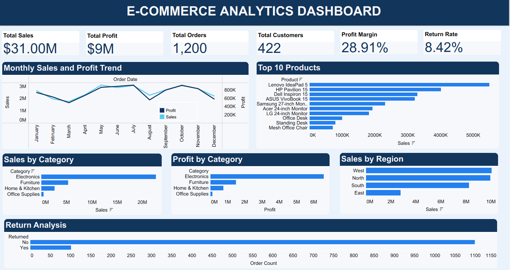

# E-Commerce Analytics Dashboard

## 📊 Project Overview

An interactive E-Commerce Analytics Dashboard built using Tableau to analyze sales, profit, customer activity, product performance, regional sales, and return trends.

The dashboard provides a consolidated view of key business performance indicators and helps identify sales and profitability patterns.

## 🛠️ Tools & Technologies

- Tableau
- Data Visualization
- Data Analysis
- Dashboard Design
- KPI Analysis

## 📌 Key KPIs

- Total Sales: $31.00M
- Total Profit: $9M
- Total Orders: 1,200
- Total Customers: 422
- Profit Margin: 28.91%
- Return Rate: 8.42%

## 📈 Dashboard Analysis

The dashboard includes:

- Monthly Sales and Profit Trend
- Top 10 Products by Sales
- Sales by Category
- Profit by Category
- Sales by Region
- Return Analysis
- Key Performance Indicator (KPI) cards

## 🔍 Key Insights

- Electronics is the highest-performing category by both sales and profit.
- Lenovo IdeaPad 5 is the top-selling product.
- West and North regions generate the highest sales.
- The dashboard shows a clear monthly variation in sales and profit.
- The majority of orders were not returned.

## 🖼️ Dashboard Preview

## 📁 Files

- `Ecommerce_Analytics_Dashboard.png` — Dashboard preview
- `Ecommerce_Analytics_Dashboard.twbx` — Tableau packaged workbook

## 🎯 Project Objective

The objective of this project is to analyze e-commerce business performance using Tableau and present meaningful insights through an interactive and visually engaging dashboard.

## 👩‍💻 Author

Lydia V
